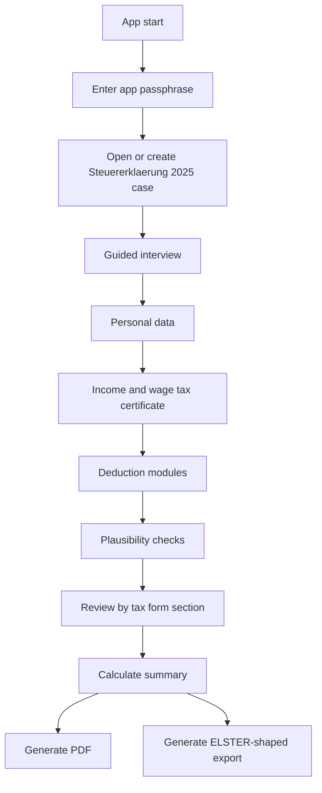
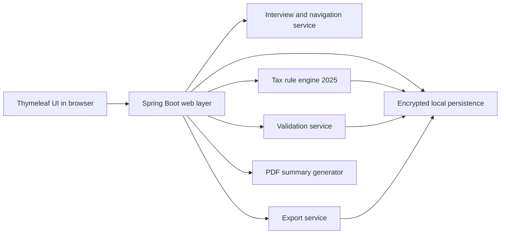
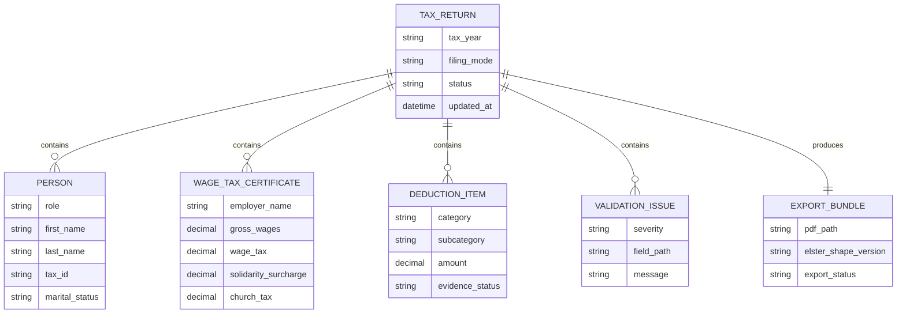

# Steuererklaerung 2025 Assistant - Product Specification

**Status:** Agreed specification. No code yet.  
**Target season:** Tax year 2025. Filing work in 2026.  
**Primary user:** German private employees.  
**UI language:** German only.

## 1. Product vision

Build a serious local-first Spring Boot application with Thymeleaf.

The app helps a German citizen prepare the 2025 income tax return.

The app guides the user step by step.

The app calculates likely tax-relevant values.

The app explains what is missing.

The app produces a PDF summary and a structured ELSTER-shaped export.

The app does **not** perform official ELSTER submission in v1.

The app is decision support, not legal or tax advice.

## 2. Fixed product decisions

1. Use newest stable Java and newest stable compatible libraries at implementation time.
2. Use Spring Boot and Thymeleaf.
3. Focus on real-world usefulness, not a demo.
4. Support private employees only.
5. Support single filing and joint filing for married couples.
6. Exclude self-employment, rental income, and business cases.
7. Exclude child-specific tax logic in v1.
8. Use a guided wizard as the main UX.
9. Keep the UI German-only.
10. Use deterministic rules, not AI, for core tax logic.
11. Run as a local-first single-user application.
12. Protect stored data with an app passphrase and encryption.

## 3. Supported scope

### In scope

- Personal data for one taxpayer or married couple.
- Address and tax-relevant base data.
- Inputs from the Lohnsteuerbescheinigung.
- Employee income and common employee deductions.
- Werbungskosten / Anlage N.
- Vorsorgeaufwand.
- Sonderausgaben.
- Haushaltsnahe Dienstleistungen.
- Aussergewoehnliche Belastungen.
- Plausibility checks.
- Progress tracking.
- Review screens mapped to form sections.
- PDF summary output.
- Structured ELSTER-shaped export output.

### Out of scope for v1

- Official ELSTER filing.
- Official ERiC integration.
- Self-employment.
- Freelance income.
- Rental income.
- Business ownership.
- Child-specific tax logic.
- Full support for every German tax edge case.
- AI-generated tax decisions.

## 4. User value

The user should feel guided, safe, and not lost.

The user should know what data is required.

The user should see which deductions may apply.

The user should get a clean review before transfer into a filing process.

The user should be able to stop and continue later.

## 5. Primary workflow

## 6. UX principles

- Use plain German.
- Ask one thing at a time.
- Group questions by life topic, not by raw form number.
- Show progress clearly.
- Show why a question matters.
- Allow save and resume.
- Highlight missing or contradictory inputs.
- End with a review that maps back to known tax forms.

## 7. Functional requirements

### 7.1 Return setup

- The user can create a return for tax year 2025.
- The user can choose single filing or joint filing.
- The app stores one local user context.
- The app supports draft status and completed status.

### 7.2 Guided interview

- The app asks only relevant questions.
- Later questions depend on earlier answers.
- The app can skip irrelevant sections.
- The app can bring the user back to incomplete sections.

### 7.3 Tax modules

#### Base data

- Taxpayer identity.
- Spouse identity if applicable.
- Address.
- Bank details for refund context if needed.
- Tax office metadata if needed for export structure.

#### Income

- Lohnsteuerbescheinigung values.
- Employer-related income details needed for Anlage N logic.

#### Deductions and expenses

- Werbungskosten.
- Commute and work-related travel where supported.
- Work equipment where supported.
- Insurance and pension contributions for Vorsorgeaufwand.
- Charitable giving and selected Sonderausgaben.
- Household services and craftsmen services where supported.
- Extraordinary burdens at the supported v1 depth.

### 7.4 Validation

- Required-field checks.
- Type and range checks.
- Cross-field consistency checks.
- Filing-mode checks.
- Form-readiness checks before export.

### 7.5 Outputs

- Human-readable PDF summary.
- Structured ELSTER-shaped export.
- Module completeness report.
- Validation issue list.

## 8. Form-oriented review model

The app should interview the user in plain German first.

The app should review the result in form-oriented sections second.

Suggested review sections:

1. Hauptvordruck / base data.
2. Anlage N.
3. Vorsorgeaufwand.
4. Sonderausgaben.
5. Haushaltsnahe Dienstleistungen.
6. Aussergewoehnliche Belastungen.
7. Final summary.

## 9. Calculation and rule engine

The calculation engine must be deterministic.

Every displayed result must be traceable to stored user inputs and a known rule.

Rules should be versioned by tax year.

Tax year 2025 rules must be isolated from later years.

The engine should separate:

1. Input collection.
2. Validation.
3. Eligibility rules.
4. Calculation rules.
5. Export mapping rules.

## 10. Security and privacy

Tax data is highly sensitive.

The app must be local-first.

The app must require an app passphrase.

The app must encrypt persisted data at rest.

The app should avoid external network calls during normal use.

The app should make exports explicit user actions.

The app should make deletion of local data possible.

The app should display a clear disclaimer:

> This application helps prepare a 2025 German tax return.  
> It does not replace official filing channels or professional tax advice.

## 11. High-level architecture

## 12. Domain model sketch

## 13. Expected screens

1. Unlock screen.
2. Return dashboard.
3. Filing mode selection.
4. Personal data wizard.
5. Income wizard.
6. Deduction module screens.
7. Validation overview.
8. Form-mapped review.
9. Result summary.
10. Export screen.

## 14. Quality requirements

- Fast startup on a normal local machine.
- Clear recovery after invalid input.
- No silent data loss.
- Stable save and resume flow.
- Transparent calculations.
- Repeatable outputs from the same inputs.

## 15. Acceptance criteria for v1 specification

The product is successful if:

1. A user can complete a guided 2025 return draft locally.
2. A user can choose single or joint filing.
3. A user can enter employee income and supported deductions.
4. The app finds missing or inconsistent inputs.
5. The app produces a readable PDF summary.
6. The app produces a structured ELSTER-shaped export.
7. Stored data remains protected by passphrase-based encryption.
8. The app never claims to submit officially to ELSTER.

## 16. Implementation direction

Use the newest stable GA releases available when implementation starts.

Prefer stable, well-supported libraries over experimental ones.

Keep tax-year rules isolated behind a dedicated 2025 rule set.

Design the project so later years, more modules, and future ELSTER integration can be added without rewriting the whole app.
